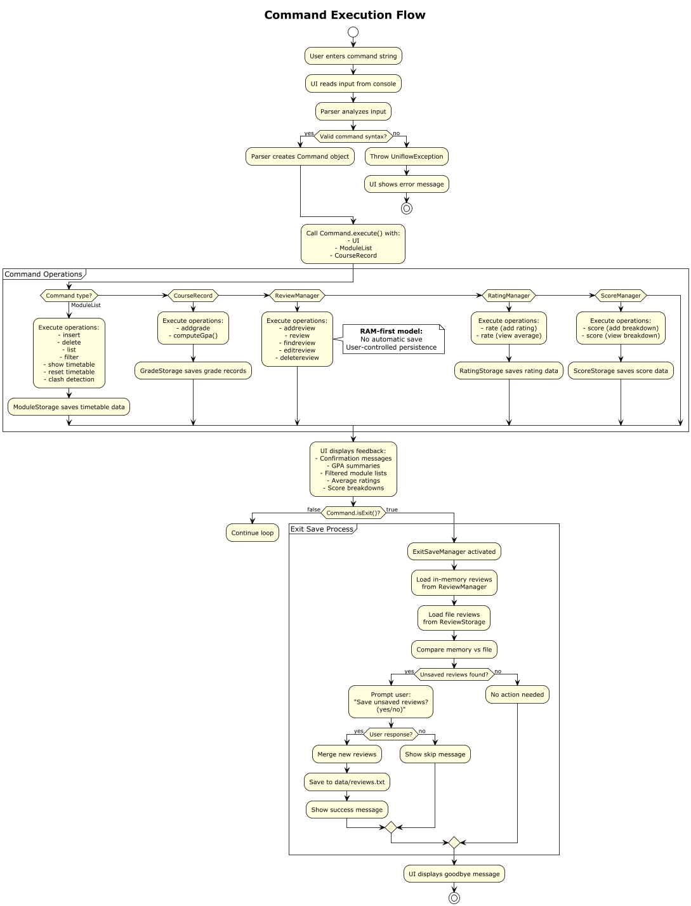
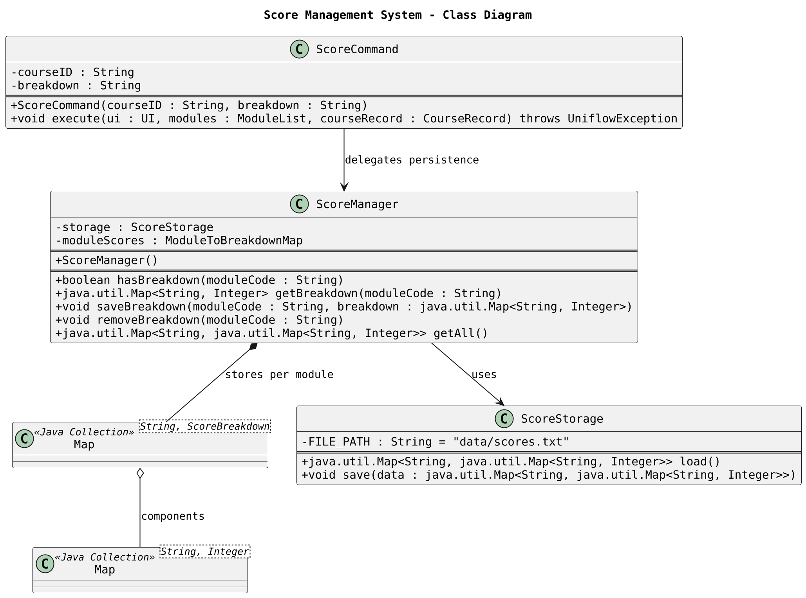
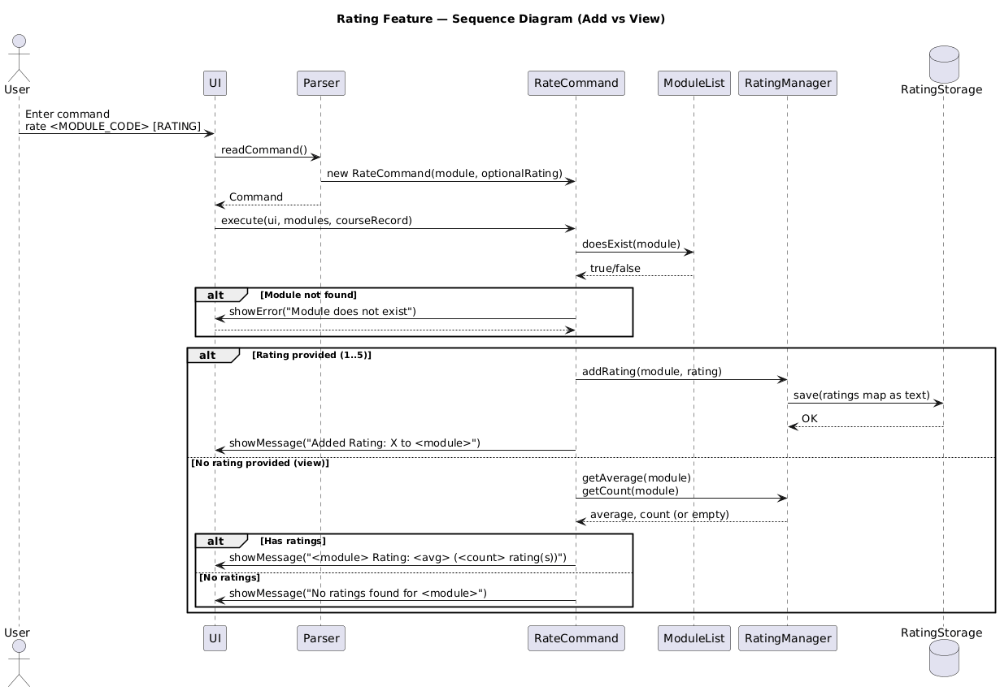

# Developer Guide

## Table of Contents
- [Acknowledgements](#acknowledgements)
- [Design & implementation](#design--implementation)
    - [Architecture Overview](#architecture-overview)
    - [Command Execution Flow](#command-execution-flow)
    - [Key Design Patterns](#key-design-patterns)
    - [Design Details](#design-details)
        - [Command Component](#command-component)
        - [Model Component](#model-component)
        - [Review Management Component](#review-management-component)
        - [Rating Management Component](#rating-management-component)
        - [Score Management Component](#score-management-component)
        - [Grade Management Component](#grade-management-component)
- [Implementation Details](#implementation-details)
    - [Show Timetable Feature](#show-timetable-feature)
    - [Reset Timetable Feature](#reset-timetable-feature)
    - [Find Review Feature](#find-review-feature)
    - [Review Counting Feature](#review-counting-feature)
    - [Review Data Persistence (ExitSaveManager)](#review-data-persistence-exitsavemanager)
    - [Review Data Synchronization (Manual)](#review-data-synchronization-manual)
    - [Review Data Management (Reload/Reset)](#review-data-management-reloadreset)
    - [Insert Module Feature](#insert-module-feature)
    - [Filter Module Feature](#filter-module-feature)
    - [GPA Calculation Feature](#gpa-calculation-feature)
    - [Projected GPA Feature](#projected-gpa-feature)
    - [Grade Management Commands](#grade-management-commands)
    - [Score Breakdown Feature](#score-breakdown-feature)
    - [Rating Feature](#rating-feature)
    - [Timetable Clash Detection](#timetable-clash-detection)
- [Product scope](#product-scope)
    - [Target user profile](#target-user-profile)
    - [Value proposition](#value-proposition)
- [User Stories](#user-stories)
- [Non-Functional Requirements](#non-functional-requirements)
- [Glossary](#glossary)
- [Instructions for manual testing](#instructions-for-manual-testing)
    - [Setting up the application](#setting-up-the-application)
    - [Testing Module Management](#testing-module-management)
    - [Testing Filtering](#testing-filtering)
    - [Testing Grade Management](#testing-grade-management)
    - [Testing Score Breakdown](#testing-score-breakdown)
    - [Testing Review System](#testing-review-system)
    - [Testing Rating System](#testing-rating-system)
    - [Testing Timetable Commands](#testing-timetable-commands)
    - [Testing Error Handling](#testing-error-handling)
    - [Data Persistence Testing](#data-persistence-testing)

## Acknowledgements

* Java 17 - Programming language and runtime environment
* JUnit 5 - Testing framework for unit tests
* Markdown - Documentation format

## Design & implementation

### Architecture Overview

Uniflow is a command-line application designed to help students manage their university modules, timetables, grades, and course reviews. The application follows an object-oriented design with clear separation of concerns.


The architecture diagram above shows the high-level design of the application. The main components are:

**Uniflow (Main Class)**
- Entry point that initializes core components and runs the main command loop
- Exposes shared singletons (e.g., `getScoreManager()`) to commands.

**UI (User Interface)**
- Handles all user interactions, reading commands via Scanner and displaying formatted results

**Parser**
- Parses user input strings into `Command` objects
- Validates command syntax and throws `UniflowException` for invalid commands

**Command (Abstract Class)**
- Base class for all command types using the Command Pattern
- Defines `execute()` method and `isExit()` to control application flow

**Module**
- Represents a scheduled module with ID, name, day/time, session type, and optional score breakdown
- Provides methods to check for tutorials and retrieve module information

**ModuleList**
- Manages the collection of modules in the timetable
- Provides add, delete, filter operations and detects timetable clashes

**Course**
- Represents a completed course with code, credits, grade and indication of whether it is a major required course

**CourseRecord**
- Manages a list of courses for academic record keeping
- It includes two separate lists, one for all courses, one for major-required courses
- It includes methods for computing the GPA of the courses stored in the record

**GradeStorage**
- It deals with loading and saving of the grade record in the `data/grades.txt` file.

**ReviewManager**
- Manages course reviews **in-memory** using a Map. Now operates in a "RAM-first" model.

**ReviewStorage**
- Handles the low-level reading and writing of review data to the `data/reviews.txt` file.

**ExitSaveManager**
- New component that detects unsaved in-memory reviews during a graceful shutdown (via `bye` command) and prompts the user (yes/no) to persist them.

**RatingManager**
- Manages course ratings from students, storing ratings in a map by module code.

**RatingStats**
- Represents the aggregate statistics (sum, count, average) for a specific course's ratings.

**RatingStorage**
- Handles persistence of rating data to the local file system using pipe-delimited format.

**ScoreManager**
- Orchestrates in-memory map `<MODULE_CODE: {component: value}>` and persistence.

**ScoreStorage**
- Handles persistence of score data to the local file system using pipe-delimited format.

### Command Execution Flow

The following workflow diagram illustrates the complete command execution flow in Uniflow:



**Workflow Steps:**
1. User enters a command string through the UI Scanner
    The `UI` component reads the input from the console.
2. Parser analyzes the input and creates the appropriate `Command object`
    It performs syntax validation and throws a `UniflowException` for invalid commands.
3. Command's `execute()` method is called with core data managers:
   - `ModuleList` - timetable and active semester modules.
   - `CourseRecord` - completed courses for GPA tracking.
   - `ReviewManager`, `RatingManager`, and `ScoreManager` - in-memory feature managers.
4. Command performs its operation:
   - **ModuleList operations**: `insert`, `delete`, `list`, `filter`, `show timetable`, `reset timetable` and clash detection.
   - **CourseRecord operations**: `addgrade`, `gpa`, and related grade persistence through GradeStorage.
   - **ReviewManager operations**: `addreview`, `review`, `findreview`, and review persistence through `ReviewStorage`.
   - **RatingManager operations**: `rate` (add/view module ratings), persistence through `RatingStorage`.
   - **ScoreManager operations**: `score` (add/view module breakdowns) persistence through `ScoreStorage`.
5. Data managers update in-memory structures and trigger persistence where needed:
   - `ModuleStorage` for timetable data.
   - `GradeStorage` for GPA records.
   - `ScoreStorage`, `ReviewStorage`, `RatingStorage` for feature-specific data.
6. UI outputs feedback to the user: confirmation messages, GPA summaries, filtered module lists, average ratings, or score breakdowns.
7. Loop continues until the user enters `bye`.
   When `Command.isExit()` returns `true`, the main loop terminates.
8. Loop continues until the user enters `bye`.
   When `Command.isExit()` returns `true`, the main loop invokes the `ExitSaveManager`.
9. `ExitSaveManager` checks for unsaved reviews by comparing memory (`ReviewManager`) to the file (`ReviewStorage`).
    - If differences are found, it prompts the user (yes/no) to save them.
    - If "yes", the new reviews are merged and saved to disk.
10. Application terminates gracefully.

### Key Design Patterns

#### Command Pattern
Every user action (e.g., `insert`, `delete`, `filter`, `rate`, `score`, `addgrade`, `review`) is implemented as a subclass of the abstract Command class.
Each command encapsulates its own logic and implements execute(), allowing new features to be added without modifying existing code.
This pattern isolates user actions, improving extensibility and testability.

#### Separation of Concerns
The system is divided into three logical layers:
- **Parser/Command Layer**: Handles command parsing and user intent.
- **Manager Layer**: Handles business logic (e.g. `ReviewManager`, `RatingManager`, `ScoreManager`).
- **Storage Layer**: Handles data persistence (`ReviewStorage`, `RatingStorage`, `ScoreStorage`, `ModuleStorage`, `GradeStorage`).
This design ensures that UI, logic, and persistence can evolve independently.

#### Data Persistence Pattern (Storage Abstraction)
Each major feature has a dedicated storage class that implements standardized load/save operations using simple delimited formats.
This keeps data handling consistent across modules (e.g., a`data/modules.txt`, `data/scores.txt`, `data/ratings.txt`).

#### Singleton-like Access
Global components a(`ReviewManager`, `RatingManager`, `ScoreManager`, `CourseRecord`, and `ModuleList`) are instantiated once and referenced through the `Uniflow` class.
This ensures a consistent shared state across commands while avoiding tight coupling.

#### Predicate-Based Filtering
`ModuleList` uses Java’s `Predicate` functional interface for dynamic filtering (e.g., by day, session type, or tutorial presence).
This makes it easy to extend filtering criteria without changing the base logic.

#### User-Controlled Persistence (RAM-First Model)
The review system operates in a "RAM-first" model. All changes (`addreview`, `editreview`, `deletereview`) modify data in memory only. This improves performance by eliminating disk I/O on every command.
Persistence to disk is now explicitly controlled by the user via:
- The `load reviews` command (which prompts to merge changes).
- The `add reviews database` command (for a manual merge/save).
- The `ExitSaveManager` (which prompts to save on graceful exit).

### Design Details

#### Command Component


The Command component uses the **Command Pattern** to encapsulate each user action as an object. This design allows for:
- Easy addition of new commands without modifying existing code
- Consistent interface for all command types
- Clear separation of command parsing and execution logic

All command classes inherit from the abstract `Command` class and implement the `execute()` method. This includes new commands such as `FindReview`, `CountReviewsCommand`, `LoadReviewsCommand`, `ResetReviewsCommand`, `AddReviewsDatabaseCommand`, `ShowTimetableCommand`, and `ResetTimetableCommand`.

#### Model Component


The Model component consists of:
- **Module**: Represents a course session with timing and session type information. Each module can store a score breakdown for different assessment components.
- **ModuleList**: Manages a collection of modules with operations for adding, deleting, filtering, and clash detection.
- **Course**: Represents a course with a grade, used for GPA calculation.
- **CourseRecord**: Manages the collection of courses.

The use of composition relationships allows ModuleList and CourseRecord to fully manage their respective collections.

#### Review Management Component
The Review Management component was refactored to a "RAM-first" architecture, separating in-memory logic from user-controlled persistence.


- **ReviewManager**: Manages the in-memory `Map` of reviews. It no longer automatically saves on `add`, `edit`, or `delete`. It provides methods like `getAllReviews()` and `loadReviews()` for persistence commands. It includes a fallback to "RAM-only" mode if the file is unreadable.
- **ReviewStorage**: A utility class responsible only for file I/O (reading and writing the `reviews.txt` file).
- **Persistence Commands**: `LoadReviewsCommand` and `AddReviewsDatabaseCommand` orchestrate the merging of data between `ReviewManager` and `ReviewStorage`.
- **ExitSaveManager**: A new component that uses `ReviewManager` and `ReviewStorage` to detect unsaved changes and prompt the user (yes/no) before the application closes via the `bye` command.

#### Rating Management Component
The Rating Management component enables users to rate modules and view average ratings for each course.
It follows the same architecture as Review Management, with a clear separation between logic, data and persistence layers.


- **RatingManager** - Maintains a `Map<String, RatingStats>` mapping module codes to their cumulative rating data.
  - It handles all business logic for adding, updating, and retrieving ratings, ensuring each rating is between 1-5.
- **RatingStats** - A helper class encapsulating statistics:
  - `sum`: total of all rating values.
  - `count`: number of ratings.
  - `average`: computed dynamically as `sum/count`
- **RatingStorage** - Manages persistence of rating data to `data/ratings.txt` using a pipe-delimited format.
  - Each line represents one record:
    `MODULE_CODE|SUM|COUNT`
  - Ratings are automatically reloaded at application start and saved on exit or when a new rating is added.


#### Score Management Component
The Score Management component allows users to store and view assessment breakdowns for individual modules.
It is designed around the same modular architecture as the Review and Rating systems.


- **ScoreManager** - Manages a `Map<String, Map<String, Integer>>` representing each module’s breakdown,
  where the key is a component name (e.g., `"exam"`, `"project"`) and the value is a score weight.
  Provides methods to:
  - Add or update a module’s breakdown 
  - Retrieve existing breakdowns 
  - Validate format and numeric values
- **ScoreStorage** - Persists breakdown data to `data/scores.txt` in the following format:
  `MODULE_CODE|name:value|name2:value2|..`
  Handles both loading and saving, ensuring file data remains synchronized with the in-memory state.

#### Rating Management Component
The Rating Management component enables users to rate modules and view average ratings for each course.
It follows the same architecture as Review Management, with a clear separation between logic, data and persistence layers.


- **RatingManager** - Maintains a `Map<String, RatingStats>` mapping module codes to their cumulative rating data.
  - It handles all business logic for adding, updating, and retrieving ratings, ensuring each rating is between 1-5.
- **RatingStats** - A helper class encapsulating statistics:
  - `sum`: total of all rating values.
  - `count`: number of ratings.
  - `average`: computed dynamically as `sum/count`
- **RatingStorage** - Manages persistence of rating data to `data/ratings.txt` using a pipe-delimited format.
  - Each line represents one record:
    `MODULE_CODE|SUM|COUNT`
  - Ratings are automatically reloaded at application start and saved on exit or when a new rating is added.


#### Score Management Component
The Score Management component allows users to store and view assessment breakdowns for individual modules.
It is designed around the same modular architecture as the Review and Rating systems.


- **ScoreManager** - Manages a `Map<String, Map<String, Integer>>` representing each module’s breakdown,
  where the key is a component name (e.g., `"exam"`, `"project"`) and the value is a score weight.
  Provides methods to:
  - Add or update a module’s breakdown 
  - Retrieve existing breakdowns 
  - Validate format and numeric values
- **ScoreStorage** - Persists breakdown data to `data/scores.txt` in the following format:
  `MODULE_CODE|name:value|name2:value2|..`
  Handles both loading and saving, ensuring file data remains synchronized with the in-memory state.

#### Grade Management Component

The Grade Management component allows users to record, display their academic grades, and compute their GPA.  
It combines the use of the CourseRecord and GradeStorage classes for GPA calculation, temporary grade testing, and grade persistence.

CourseRecord: Two lists of CourseRecord in Uniflow— one for confirmed grades (will be saved) and one for temporary predicted grades used in projection. Responsible for computing GPA.    
*Remark: tempRecord in Uniflow.java stored the predicted grades temporarily.*   
  
**GradeStorage**: Handles loading and saving of grade record in data/grades.txt, ensuring persistence between sessions.  
- completed courses will be stored in the format:  
  `EC3322 | 5 | B | 1`  
- When the user uses Uniflow again, it will read the stored data and load the saved course records.  
  
Some of the Commands Implemented:
  
`AddGradeCommand` – Adds a completed course's grade.  
`ShowGradeCommand` – Displays all saved grades.  
`RemoveGradeCommand` – Deletes a grade record.  
`AddTestGradeCommand`, `RemoveTestGradeCommand` – Manage predicted grades and projected GPA.  
`ProjectGpaCommand` – Combines attained grades and predicted grades to calculate projected GPA.  

Design Rationale:
Separate handling for predicted grades allows users to explore a projected GPA simulation safely without overwriting confirmed academic record.

### Implementation Details

#### Find Review Feature
The find review feature allows users to search the **in-memory** review list.
1.  Parser creates a `FindReview` command with the user and/or course arguments.
2.  The command calls `reviewManager.getReviews()` or `reviewManager.getAllCourseIds()` to fetch the current in-memory data.
3.  It filters this data based on the provided arguments (user, course, or both).
4.  The filtered results are passed to the `UI` for display.

#### Review Data Persistence (ExitSaveManager)
To prevent data loss on graceful exit, a user-prompted save mechanism is implemented, replacing the previous automatic shutdown hook.

1.  When the user types `bye`, the main loop in `Uniflow.java` detects `c.isExit() == true`.
2.  It instantiates the new `ExitSaveManager` and calls `promptSaveBeforeExit()`.
3.  `ExitSaveManager` loads both file data (`ReviewStorage.load()`) and memory data (`reviewManager.getAllReviews()`).
4.  It detects if there are any reviews in memory that are not present in the file.
5.  If differences exist, it uses the `UI` to ask the user: "You have unsaved reviews... (yes/no)".
6.  If the user replies "yes", it merges and saves the new reviews to the file.
7.  This component uses Java Reflection to access private helper methods in `LoadReviewsCommand` (`detectUnsavedReviews`, `mergeAndSaveReviews`) to avoid code duplication.

#### Review Data Management (Reload/Reset)
The commands for managing the review state were updated for the "RAM-first" model.

* **`LoadReviewsCommand`**: This command (`load reviews`) first checks for unsaved in-memory changes (by comparing memory to the file).
    * If unsaved changes are found, it prompts the user ("yes/no") to **merge** them into the file *before* reloading.
    * After the optional merge, it clears the in-memory `ReviewManager` and reloads all reviews from `ReviewStorage`.

* **`ResetReviewsCommand`**: This command (`reset all reviews`) now **only affects memory**.
    * It calls `reviewManager.clearAll()`, wiping the in-memory review list.
    * It does not modify the `data/reviews.txt` file, allowing users to clear their session for testing.

#### Review Data Synchronization (Manual)
A new command was added for explicit, user-controlled synchronization.

* **`AddReviewsDatabaseCommand`**: This command (`add reviews database`) provides a way to manually save progress.
    * It performs a one-way merge, adding any reviews from memory into the file.
    * It does not clear memory and does not ask for confirmation.
    * This allows the user to save their work without exiting or reloading.

#### Review Counting Feature
* **`CountReviewsCommand`**: This new command (`amount reviews`) allows the user to count the number of reviews currently loaded in memory.
    * It uses the same parsing logic as `findreview` to support counting by user (`u/USER`), by course (`c/COURSE`), or both.

#### Show Timetable Feature
* The `ShowTimetableCommand` (`show timetable`) was implemented to provide a clean, formatted view of all modules.
* It iterates through the `ModuleList` and uses `UI` to display all module details, including ID, name, day, time, and session type, offering a more readable alternative to the `list` command.

#### Reset Timetable Feature
* The `ResetTimetableCommand` (`reset timetable`) was implemented to clear all modules from the `ModuleList`.
* It calls `modules.clear()` and provides user feedback via the `UI`.

#### Insert Module Feature

The insert module feature allows users to add modules to their timetable with automatic clash detection.


How the insert feature works:

1. Parser creates an InsertCommand with a new Module object
2. InsertCommand checks for timetable clashes by calling `findClash()`
3. If a clash is detected, the user is warned and asked for confirmation
4. If no clash exists or the user confirms, the module is added to ModuleList
5. A success message is displayed showing the updated module count

The clash detection algorithm compares time ranges on the same day using Java's LocalTime class to determine if any overlap exists.

#### Filter Module Feature

The filter feature allows users to search modules using various criteria.


How filtering works:

1. Parser creates a FilterCommand with the filter type and value
2. FilterCommand calls the appropriate filter method on ModuleList
3. ModuleList uses predicate-based filtering to create a new filtered list
4. The filtered results are displayed to the user

The application supports filtering by: day, session type, module ID, module name, and tutorial presence. The predicate-based approach allows for flexible and extensible filtering logic.

#### GPA Calculation Feature

The GPA calculation feature computes the cumulative GPA based on completed courses.


How GPA calculation works:

1. Execution of `gpa` command will call the computeGpa() method in CourseRecord. 
2. For each course, the letter grade is converted to a grade point (A+ = 5.0, B+ = 4.0)
3. The total_grade_points is calculated: Σ(grade_point × credits)
4. GPA = total_grade_points / total_credits
5. The result is displayed with summary statistics (e.g. the number of courses and credits studied)

The grade point conversion follows the standard NUS grading scale.

#### Projected GPA Feature

The projected GPA feature allows users to simulate their projected GPA result based on predicted grades of future courses.

How it works:

1. The user enters their predicted grades of not yet completed courses using   
    `addtestgrade c/COURSE_CODE cr/NUMBER_OF_CREDITS g/GRADE m/IS_MAJOR`.  
2. These will be stored in a temporary course record list.  
3. `projectgpa` command combined the courses from permanent and temporary records and compute a projected GPA.  
4. The result shows the projected overall GPA based on the predictions.  

This feature helps students plan ahead and understand how their upcoming courses' performances impact their GPA.  
The temporary record will not be saved as permanant record and is just for testing in this execution.  

#### Grade Management Commands

The following commands are used to facilitate the management and organisation of the course record.  
  
`showgrade` – Displays the completed courses and allows users to track what is stored.  
`removegrade INDEX` – Deletes a course grade from the permanent record by user-specified index.  
`showtempgrade` – Displays the predicted grades currently stored in a temporary record, allowing users to track their current inputs.
`removetempgrade INDEX` – Deletes a predicted grade from the temporary record.

Input Validation:
All command inputs will be checked to ensure validity. Invalid input will cause a UniflowException that displays a reminder to users.

#### Score Breakdown Feature
Stores per-module assessment breakdowns like `exam:50 project:30`


How the score feature works:
1. Parser validates `score <MODULE_CODE> [name:value ...]`.
   - No args after code ⇒ query mode (show existing breakdown).
   - Robust checks: non-empty pairs, `:` present, numeric non-negative values, whitespace/commas normalized.
2. ScoreCommand verifies the module exists in `ModuleList` (module-centric model).
3. If adding/updating:
   - Parses pairs into `Map<String,Integer>`.
   - Updates the module's in-memory `scoreBreakdown`
   - Persists via `ScoreManager`, which writes the full map to disk using `ScoreStorage`.
4. If querying:
   - Reads from the module if present; otherwise tries `ScoreManager` to hydrate and display.

#### Rating Feature
The rating feature allows users to rate modules they've taken and view the average rating for each module.



How it works:
1. Parser creates a `RateCommand` when the user enters `rate <MODULE_CODE> [RATING]`
2. If rating value (1-5) is provided:
   - `RateCommand` validates that the course exists in `CourseRecord`
   - The rating is then passed to `RatingManager`, which updates the total and count
   - `RatingStorage` saves the updated data to a file (`data/ratings.txt`)
3. If no rating is provided:
   - RateCommand` retrieves the average rating and rating count from `RatingManager`
   - Displays the average if ratings exist, or a message if none are found
4. The UI displays a confirmation or the average rating result to the user

#### Timetable Clash Detection

When adding a new module, the system checks for scheduling conflicts:

1. ModuleList iterates through all existing modules on the same day
2. For each module, it compares time ranges using `checkOverlap()`
3. Time strings are parsed into LocalTime objects for accurate comparison
4. Two time ranges overlap if: `!(end1 < start2) AND !(end2 < start1)`
5. If an overlap is found, that module is returned as the clashing module

This prevents students from accidentally scheduling multiple classes at the same time.

## Product scope

### Target user profile

Uniflow is designed for university students who:
* Need to manage multiple course modules and sessions (lectures, tutorials, labs)
* Want to track their academic performance and calculate GPA
* Prefer command-line interfaces for quick data entry
* Need to avoid timetable clashes when planning their schedule
* Want to access and share course reviews with peers
* Want to rate courses and see average ratings to inform module selection
* Are comfortable typing commands and structured input formats

### Value proposition

Uniflow solves several problems for university students:

**Timetable Management**: Students can quickly add modules with specific time slots and session types, with automatic clash detection to prevent scheduling conflicts.

**Academic Tracking**: The application allows students to record completed courses with grades and automatically calculates cumulative GPA, helping them monitor academic progress.

**Module Organization**: Students can filter and search modules by various criteria (day, session type, module code, name), making it easy to find specific classes or plan study schedules.

**Peer Reviews**: The review system enables students to share and read course experiences, helping with module selection decisions.

**Score Breakdown**: Students can store and retrieve component scores for transparency on assessment structure.

**Course Ratings**: A lightweight rating system that lets students rate modules and view average ratings, providing a quick and quantitative signal alongside reviews.

**Efficiency**: Command-line interface allows for faster data entry compared to GUI applications, ideal for students who need to quickly update their schedules between classes.

## User Stories

| Version | As a ...  | I want to ...                        | So that I can ...                                                     |
|---------|-----------|--------------------------------------|-----------------------------------------------------------------------|
| v1.0    | new user  | see usage instructions               | refer to them when I forget how to use the application                |
| v1.0    | student   | add modules to my timetable          | keep track of all my classes                                          |
| v1.0    | student   | delete modules from my timetable     | remove classes I've dropped                                           |
| v1.0    | student   | list all my modules                  | see my complete schedule at a glance                                  |
| v1.0    | student   | check for timetable clashes          | avoid scheduling conflicts                                            |
| v2.0    | student   | filter modules by day                | see what classes I have on specific days                              |
| v2.0    | student   | filter modules by session type       | quickly find all my tutorials or labs                                 |
| v2.0    | student   | search modules by code or name       | locate specific modules without scanning the entire list              |
| v2.0    | student   | add my grades for completed courses  | maintain an academic record                                           |
| v2.0    | student   | add predicted grades for courses     | manage expectations for courses                                       |
| v2.0    | student   | calculate my GPA automatically       | track my academic performance                                         |
| v2.0    | student   | calculate my Major GPA automatically | track my academic performance with clearer picture                    |
| v2.0    | student   | calculate my projected GPA           | manage and set strategy for studying                                  |
| v2.0    | student   | store score breakdowns for modules   | track individual assessment components                                |
| v2.0    | student   | add reviews for courses              | share my experiences with other students                              |
| v2.0    | student   | read reviews for courses             | make informed decisions about module selection                        |
| v2.0    | student   | reset my timetable                   | start fresh for a new semester                                        |
| v2.0    | student   | rate a course                        | share simple feedback on module quality                               |
| v2.0    | student   | search for reviews by user           | see all feedback from a specific person                               |
| v2.0    | student   | search for reviews by user & course  | find a specific person's review for a course                          |
| v2.0    | (dev)     | manually reload reviews from file    | test persistence without restarting the app                           |
| v2.0    | (dev)     | reset all reviews                    | clear the in-memory state for testing (without affecting the file)    |
| v2.1    | (student) | view all scores for a module         | review performance breakdowns across assessments                      |
| v2.1    | (student) | update component scores for a module | correct mistakes or refine ongoing assessments                        |
| v2.1    | (student) | view the average rating for a module | decide which modules to take next semester                            |
| v2.1    | student   | be prompted to save reviews on exit  | not lose work if user forget to save manually                         |
| v2.1    | student   | count reviews for a course           | see how many reviews a course has                                     |
| v2.1    | student   | show/remove grades of the record     | have more organised record and better management of academic progress |
| v2.1    | (dev)     | manually merge reviews to disk       | save user progress without exiting or reloading                       |


## Non-Functional Requirements

1. **Usability**: Commands should be intuitive and follow consistent patterns. Error messages must be clear and guide users toward correct usage.

2. **Performance**: The application should respond to commands instantly (< 100ms) for typical operations with up to 50 modules.

3. **Reliability**: Data persistence for reviews is user-controlled. The `ExitSaveManager` prompts the user to save unsaved changes on graceful exit (`bye`) to prevent data loss.

4. **Portability**: The application should run on any system with Java 11 or higher installed (Windows, macOS, Linux).

5. **Maintainability**: Code should follow object-oriented principles with clear separation of concerns. Each command class should be independent and easily modifiable.

6. **Data Integrity**: Grade point calculations must be accurate. Invalid grades should be rejected. For review data, the `ReviewCleaner` component ensures corrupted or incomplete entries are automatically removed from the data file to prevent loading invalid data.

7. **Scalability**: The filtering mechanism should handle multiple filter criteria efficiently using predicate-based filtering.

## Glossary

* **Module** - A university course or subject with scheduled sessions.
* **Session Type** - The type of class session (lecture, tutorial, lab, etc.)
* **Timetable Clash** - When two modules are scheduled at overlapping times on the same day.
* **Course Record** - Collection of completed courses with grades for GPA calculation.
* **GPA** - Grade Point Average, calculated from course grades and credits.
* **Major GPA** - Grade Point Average that only accounts for major-required courses. Used by many universities as a graduation requirement. 
* **Score Breakdown** - Individual assessment components and their weightings for a module.
* **ScoreManager** - Manages creation, updating, and retrieval of score breakdowns for each module.
* **ScoreStorage** - Handles the persistence of score breakdown data to file and ensures integrity between sessions.
* **Review** - Student feedback and experiences shared about a specific course.
* **ReviewManager** - Handles in-memory management of reviews (adding, editing, finding, deleting).
* **ReviewStorage** - Reads and writes all review data to persistent storage.
* **ExitSaveManager** - A component that detects unsaved reviews on exit and prompts the user to save them.
* **RAM-First** - An architecture model where data is modified in memory and only saved to persistent storage on explicit user action.
* **Rating** - Numerical evaluation of a course's quality, used to compute average ratings displayed to students.
* **RatingManager** - Manages ratings per module, tracking total ratings, count, and computing the average.
* **RatingStorage** - Persists rating data between sessions and reconstructs module ratings on load.

## Instructions for manual testing

### Setting up the application

1. Ensure you have Java 11 or higher installed on your system
2. Download the Uniflow.jar file
3. Open a terminal/command prompt and navigate to the directory containing the jar file
4. Run the application: `java -jar Uniflow.jar`

### Testing Module Management

**Adding modules:**
```
insert i/CS2113 n/Software Engineering d/Monday f/14:00 t/16:00 s/lecture
insert i/CS2113 n/Software Engineering d/Tuesday f/10:00 t/11:00 s/tutorial
insert i/MA1521 n/Calculus d/Wednesday f/09:00 t/11:00 s/lecture
```
Expected: Each module is added with confirmation message showing module count.

**Testing clash detection:**
```
insert i/ST2334 n/Statistics d/Monday f/15:00 t/17:00 s/lecture
```
Expected: Warning about clash with CS2113 on Monday. Application prompts for confirmation.

**Listing modules:**
```
list
```
Expected: All added modules displayed with their details.

**Deleting modules:**
```
delete i/CS2113
```
Expected: First CS2113 entry removed. Confirmation message shows remaining module count.

### Testing Filtering

**Filter by day:**
```
filter day/Monday
```
Expected: Shows only modules scheduled on Monday.

**Filter by session type:**
```
filter type/tutorial
```
Expected: Shows only tutorial sessions.

**Filter modules with tutorials:**
```
filter hastutorial
```
Expected: Shows modules that have tutorial sessions.

**Filter by module code:**
```
filter id/CS
```
Expected: Shows all modules with "CS" in their code.

### Testing Grade Management

**Adding grades:**
```
addgrade c/CS2113 cr/4 g/A m/true
addgrade c/MA1521 cr/4 g/B+ m/true
addgrade c/ST2334 cr/4 g/A- m/true
```
Expected: Each course is added to academic record with confirmation.

**Computing GPA:**
```
gpa
```
Expected: Displays total courses studied, total grade points, total credits studied, and calculated GPA (for both all courses and major required GPA).

**Testing invalid grade:**
```
addgrade c/CS1010 cr/4 g/Z m/true
```
Expected: Error message about invalid grade.

**Testing invalid IsMajor:**
```
addgrade c/CS1010 cr/4 g/Z m/test
```
Expected: Error message that reminds users to input true/false.

**Testing missing components:**
```
addgrade c/CS1010 g/Z m/test
```
Expected: Error message that reminds users to follow the correct format.

**Testing invalid index for removegrade:**
```
removegrade -1
```
Expected: Error message that reminds users to enter a valid index.

**Testing Storage:**
1. Add a grade to the permanent course record using the command `addgrade`.
2. Exit Uniflow.
3. Run Uniflow again.
4. Type the command `showgrade`.
5. The previously added grade should appear on the list. 

### Testing Score Breakdown

**Adding score breakdown:**
```
score CS2113 exam:50 project:30 participation:20
```
Expected: Confirmation that breakdown is saved for CS2113.

**Testing invalid breakdown format:**
```
score CS2113 exam:fifty
```
Expected: Error message about invalid format.

### Testing Review System

**Adding reviews (in-memory):**
```commandline
addreview c/CS2113 u/Alice r/Great course, very practical! addreview c/CS2113 u/Bob r/Challenging but rewarding
```
Expected: Confirmation that reviews are added (to memory).

**Viewing reviews (from memory):**
```commandline
review CS2113
```
Expected: Both reviews displayed with usernames.

**Viewing non-existent course:**
```commandline
review CS9999
```
Expected: Message indicating no reviews found.

**Testing Find Review:**
```commandline
findreview u/Alice
```
Expected: Shows only the review from Alice (`Great course, very practical!`).
```commandline
findreview u/Bob c/CS2113
```
Expected: Shows only Bob's review for CS2113.
```commandline
findreview u/NonExistentUser
```
Expected: Message indicating no reviews found for this user.

**Testing Count Reviews:**
```commandline
amount reviews c/CS2113
```
Expected: Message showing the count of reviews for CS2113 (e.g., "Course CS2113 has 2 review(s).").


### Testing Review Data Management (Reload/Reset)

**Test 1: Resetting memory**
First, add a new review to memory:
```commandline
addreview c/TEST101 u/Tester r/Hello
```
Expected: Confirmation that review is added.
```commandline
reset all reviews
```
Expected: All reviews have been cleared from memory.
```commandline
review TEST101
```
Expected: No reviews found.

**Test 2: Reloading from file, run the load command**
```commandline
load reviews
```
Expected: All reviews successfully reloaded from file.
```commandline
review CS2113
```
Expected: Shows default reviews from file.

### Testing Rating System

**Adding a rating**
```commandline
rate CS2113 4
```
Expected: Message confirming that the rating has been added.
**Viewing Average Rating**
```commandline
rate CS2113
```
Expected: Displays the average rating and number of ratings per course.

### Testing Timetable Commands

**Show timetable:**
```
show timetable
```
Expected: All modules displayed with index numbers.

**Reset timetable:**
```
reset timetable
```
Expected: Confirmation that timetable is cleared. Subsequent `list` should show empty timetable.

### Testing Error Handling

**Empty command:**
```
(press Enter without typing anything)
```
Expected: Error message about empty command.

**Invalid command:**
```
xyz
```
Expected: Error message about invalid command.

**Missing parameters:**
```
insert i/CS2113
```
Expected: Error about missing fields.

**Testing Find Review:**
```
findreview u/Alice
```
Expected: Shows only the review from Alice (`Great course, very practical!`).

```
findreview u/Bob c/CS2113
```
Expected: Shows only Bob's review for CS2113.

```
findreview u/NonExistentUser
```
Expected: Message indicating no reviews found for this user.

**Testing Review Data Management (Reload/Reset):**
```
reset all reviews
```
Expected: Confirmation that reviews are reset. `review CS2113` should now show default data (or nothing).

```
reloadreviews
```
Expected: Confirmation that reviews are reloaded from file.

### Data Persistence Testing

1. Add several reviews using `addreview` commands
2. Exit the application with `bye`
3. Restart the application
4. Use `review` command to verify reviews are loaded
5. Check that `data/reviews.txt` file exists and contains review data in format: course|user|review


[↑ Back to top](#developer-guide)
