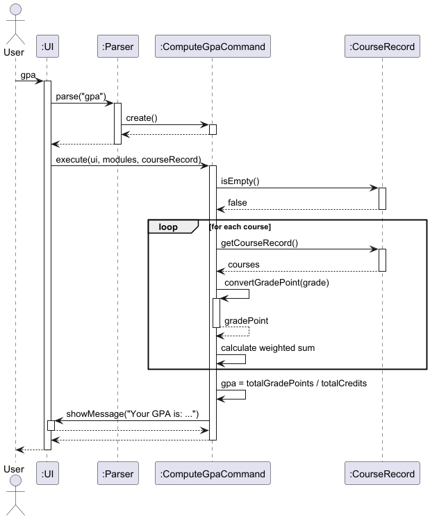

# Developer Guide

## Acknowledgements

* Java 17 - Programming language and runtime environment
* JUnit 5 - Testing framework for unit tests
* Markdown - Documentation format

## Design & implementation

### Architecture Overview

Uniflow is a command-line application designed to help students manage their university modules, timetables, grades, and course reviews. The application follows an object-oriented design with clear separation of concerns.


The architecture diagram above shows the high-level design of the application. The main components are:

**Uniflow (Main Class)**
- Entry point that initializes core components and runs the main command loop
- Exposes shared singletons (e.g., `getScoreManager()`) to commands.

**UI (User Interface)**
- Handles all user interactions, reading commands via Scanner and displaying formatted results

**Parser**
- Parses user input strings into `Command` objects
- Validates command syntax and throws `UniflowException` for invalid commands

**Command (Abstract Class)**
- Base class for all command types using the Command Pattern
- Defines `execute()` method and `isExit()` to control application flow

**Module**
- Represents a scheduled module with ID, name, day/time, session type, and optional score breakdown
- Provides methods to check for tutorials and retrieve module information

**ModuleList**
- Manages the collection of modules in the timetable
- Provides add, delete, filter operations and detects timetable clashes

**Course**
- Represents a completed course with code, credits, and grade for GPA calculation

**CourseRecord**
- Manages completed courses for academic record keeping

**ReviewManager**
- Manages course reviews from students, storing reviews in a Map keyed by module code

**ReviewStorage**
- Handles persistence of review data to file using pipe-delimited format

**ReviewCleaner**
- Automatically cleans data file by removing incomplete or corrupted review entries during the save process to maintain data integrity.

**ReviewSyncManager**
- Manages the automatic saving of data.
- Implements a shutdown hook to ensure all in-memory review data is flushed to disk via `ReviewStorage` and `ReviewCleaner` upon application exit, preventing data loss.

**RatingManager**
- Manages course ratings from students, storing ratings in a map by module code.

**RatingStats**
- Represents the aggregate statistics (sum, count, average) for a specific course's ratings.

**RatingStorage**
- Handles persistence of rating data to the local file system using pipe-delimited format.

**ScoreManager**
- Orchestrates in-memory map `<MODULE_CODE: {component: value}>` and persistence.

**ScoreStorage**
- Handles persistence of score data to the local file system using pipe-delimited format.

### Command Execution Flow

```
User Input → Parser → Command Object → execute() → Updates Data → UI Output → Loop/Exit
```

1. User enters a command string through the UI Scanner
    The `UI` component reads the input from the console.
2. Parser analyzes the input and creates the appropriate `Command object`
    It performs syntax validation and throws a `UniflowException` for invalid commands.
3. Command's `execute()` method is called with core data managers:
   - `ModuleList` - timetable and active semester modules.
   - `CourseRecord` - completed courses for GPA tracking.
   - `ReviewManager`, `RatingManager`, and `ScoreManager` - in-memory feature managers.
4. Command performs its operation:
   - **ModuleList operations**: `insert`, `delete`, `list`, `filter`, `show timetable`, `reset timetable` and clash detection.
   - **CourseRecord operations**: `addgrade`, `gpa`, and related grade persistence through GradeStorage.
   - **ReviewManager operations**: `addreview`, `review`, `findreview`, and review persistence through `ReviewStorage`.
   - **RatingManager operations**: `rate` (add/view module ratings), persistence through `RatingStorage`.
   - **ScoreManager operations**: `score` (add/view module breakdowns) persistence through `ScoreStorage`.
5. Data managers update in-memory structures and trigger persistence where needed:
   - `ModuleStorage` for timetable data.
   - `GradeStorage` for GPA records.
   - `ScoreStorage`, `ReviewStorage`, `RatingStorage` for feature-specific data.
6. UI outputs feedback to the user: confirmation messages, GPA summaries, filtered module lists, average ratings, or score breakdowns.
7. Loop continues until the user enters `bye`.
   When `Command.isExit()` returns `true`, the main loop terminates.
8. On exit (graceful or abrupt):
   The `ReviewSyncManager` shutdown hook is triggered, ensuring that `ReviewStorage`, `RatingStorage`, and `ScoreStorage` flush all in-memory data safely to disk.
9. Application terminates gracefully, with all data persisted to the `/data` directory.

### Key Design Patterns

#### Command Pattern
Every user action (e.g., `insert`, `delete`, `filter`, `rate`, `score`, `addgrade`, `review`) is implemented as a subclass of the abstract Command class.
Each command encapsulates its own logic and implements execute(), allowing new features to be added without modifying existing code.
This pattern isolates user actions, improving extensibility and testability.

#### Separation of Concerns
The system is divided into three logical layers:
- **Parser/Command Layer**: Handles command parsing and user intent.
- **Manager Layer**: Handles business logic (e.g. `ReviewManager`, `RatingManager`, `ScoreManager`).
- **Storage Layer**: Handles data persistence (`ReviewStorage`, `RatingStorage`, `ScoreStorage`, `ModuleStorage`, `GradeStorage`).
This design ensures that UI, logic, and persistence can evolve independently.

#### Data Persistence Pattern (Storage Abstraction)
Each major feature has a dedicated storage class that implements standardized load/save operations using simple delimited formats.
This keeps data handling consistent across modules (e.g., a`data/modules.txt`, `data/scores.txt`, `data/ratings.txt`).

#### Singleton-like Access
Global components a(`ReviewManager`, `RatingManager`, `ScoreManager`, `CourseRecord`, and `ModuleList`) are instantiated once and referenced through the `Uniflow` class.
This ensures a consistent shared state across commands while avoiding tight coupling.

#### Predicate-Based Filtering
`ModuleList` uses Java’s `Predicate` functional interface for dynamic filtering (e.g., by day, session type, or tutorial presence).
This makes it easy to extend filtering criteria without changing the base logic.

#### Fail-Safe Shutdown (Observer/Hook Pattern)
`ReviewSyncManager` registers a JVM shutdown hook that automatically flushes all unsaved data from memory to disk.
This ensures integrity for reviews, ratings, and scores even if the user terminates the application abruptly.


### Design Details

#### Command Component


The Command component uses the **Command Pattern** to encapsulate each user action as an object. This design allows for:
- Easy addition of new commands without modifying existing code
- Consistent interface for all command types
- Clear separation of command parsing and execution logic

All command classes inherit from the abstract `Command` class and implement the `execute()` method. The placeholder `XYZCommand` represents additional command classes like `ScoreCommand`, `ShowTimetableCommand`, `ResetTimetableCommand`, `ReviewCommand`, `AddReviewCommand`, and `ExitCommand`.

#### Model Component


The Model component consists of:
- **Module**: Represents a course session with timing and session type information. Each module can store a score breakdown for different assessment components.
- **ModuleList**: Manages a collection of modules with operations for adding, deleting, filtering, and clash detection.
- **Course**: Represents a completed course with a grade, used for GPA calculation.
- **CourseRecord**: Manages the collection of completed courses.

The use of composition relationships allows ModuleList and CourseRecord to fully manage their respective collections.

#### Review Management Component
The ReviewManager handles in-memory storage of course reviews, while ReviewStorage manages persistence to the file system. This separation follows the **Single Responsibility Principle**, making it easier to modify storage mechanisms without affecting review management logic.

This component also includes:


- **ReviewSyncManager**: A persistence utility that installs a shutdown hook. This hook ensures that `ReviewManager.flush()` is called automatically just before the application terminates, guaranteeing that all reviews are saved and cleaned.
- **ReviewCleaner**: A utility used by the `ReviewSyncManager` to remove any corrupted or incomplete lines from the review file during the save process, ensuring data integrity.


The ReviewManager handles in-memory storage of course reviews, while ReviewStorage manages persistence to the file system. This separation follows the **Single Responsibility Principle**, making it easier to modify storage mechanisms without affecting review management logic.

#### Rating Management Component
The Rating Management component enables users to rate modules and view average ratings for each course.
It follows the same architecture as Review Management, with a clear separation between logic, data and persistence layers.


- **RatingManager** - Maintains a `Map<String, RatingStats>` mapping module codes to their cumulative rating data.
  - It handles all business logic for adding, updating, and retrieving ratings, ensuring each rating is between 1-5.
- **RatingStats** - A helper class encapsulating statistics:
  - `sum`: total of all rating values.
  - `count`: number of ratings.
  - `average`: computed dynamically as `sum/count`
- **RatingStorage** - Manages persistence of rating data to `data/ratings.txt` using a pipe-delimited format.
  - Each line represents one record:
    `MODULE_CODE|SUM|COUNT`
  - Ratings are automatically reloaded at application start and saved on exit or when a new rating is added.


#### Score Management Component
The Score Management component allows users to store and view assessment breakdowns for individual modules.
It is designed around the same modular architecture as the Review and Rating systems.


- **ScoreManager** - Manages a `Map<String, Map<String, Integer>>` representing each module’s breakdown,
  where the key is a component name (e.g., `"exam"`, `"project"`) and the value is a score weight.
  Provides methods to:
  - Add or update a module’s breakdown 
  - Retrieve existing breakdowns 
  - Validate format and numeric values
- **ScoreStorage** - Persists breakdown data to `data/scores.txt` in the following format:
  `MODULE_CODE|name:value|name2:value2|..`
  Handles both loading and saving, ensuring file data remains synchronized with the in-memory state.

### Implementation Details

#### Find Review Feature
The find review feature allows users to search the review database using flexible criteria, such as by user, by course, or both.

1. Parser creates a `FindReviewCommand` with predicates for user and/or course code.
2. `FindReviewCommand` calls `ReviewManager` to filter the list of all reviews.
3. If no criteria are given (e.g., just `findreview`), it can be set to show all reviews or a specific error.
4. The filtered review list is passed to the `UI` for display.

This allows users to quickly find all feedback from a specific person or all feedback for a specific course.

#### Review Data Persistence (ReviewSyncManager & ReviewCleaner)
To prevent data loss from abrupt termination, a robust persistence mechanism is implemented.

1. On application startup, `ReviewSyncManager` installs a JVM shutdown hook.
2. When the application begins to terminate (either via `bye` command or closing the window), the hook is triggered.
3. The hook executes the `ReviewManager.flush()` method.
4. `ReviewManager` passes its data to `ReviewStorage`, which first uses `ReviewCleaner` to sanitize the existing file of corrupted entries.
5. `ReviewStorage` then writes the current in-memory reviews to the cleaned file.

This design ensures data is always saved correctly without requiring explicit user action.

#### Review Data Management (Reload/Reset)
Two utility commands were added for testing and data synchronization:

* **`ReloadReviewsCommand`**: This command (`reloadreviews`) manually clears the in-memory `ReviewManager` and reloads all reviews from the `data/reviews.txt` file. This is useful for testing or if the file was modified externally while the application is running.
* **`ResetReviewsCommand`**: This command (`reset all reviews`) clears the current review data and reloads the *default* set of reviews, effectively resetting the application's review state to its initial configuration for testing.

#### Insert Module Feature

The insert module feature allows users to add modules to their timetable with automatic clash detection.


How the insert feature works:

1. Parser creates an InsertCommand with a new Module object
2. InsertCommand checks for timetable clashes by calling `findClash()`
3. If a clash is detected, the user is warned and asked for confirmation
4. If no clash exists or the user confirms, the module is added to ModuleList
5. A success message is displayed showing the updated module count

The clash detection algorithm compares time ranges on the same day using Java's LocalTime class to determine if any overlap exists.

#### Filter Module Feature

The filter feature allows users to search modules using various criteria.


How filtering works:

1. Parser creates a FilterCommand with the filter type and value
2. FilterCommand calls the appropriate filter method on ModuleList
3. ModuleList uses predicate-based filtering to create a new filtered list
4. The filtered results are displayed to the user

The application supports filtering by: day, session type, module ID, module name, and tutorial presence. The predicate-based approach allows for flexible and extensible filtering logic.

#### GPA Calculation Feature

The GPA calculation feature computes the cumulative GPA based on completed courses.



How GPA calculation works:

1. ComputeGpaCommand retrieves all courses from CourseRecord
2. For each course, the letter grade is converted to a grade point (A+ = 5.0, F = 0.0)
3. The weighted sum is calculated: Σ(grade_point × credits)
4. GPA = total_grade_points / total_credits
5. The result is displayed with summary statistics

The grade point conversion follows the standard NUS grading scale.

#### Score Breakdown Feature
Stores per-module assessment breakdowns like `exam:50 project:30`


How the score feature works:
1. Parser validates `score <MODULE_CODE> [name:value ...]`.
   - No args after code ⇒ query mode (show existing breakdown).
   - Robust checks: non-empty pairs, `:` present, numeric non-negative values, whitespace/commas normalized.
2. ScoreCommand verifies the module exists in `ModuleList` (module-centric model).
3. If adding/updating:
   - Parses pairs into `Map<String,Integer>`.
   - Updates the module's in-memory `scoreBreakdown`
   - Persists via `ScoreManager`, which writes the full map to disk using `ScoreStorage`.
4. If querying:
   - Reads from the module if present; otherwise tries `ScoreManager` to hydrate and display.

#### Rating Feature
The rating feature allows users to rate modules they've taken and view the average rating for each module.


How it works:
1. Parser creates a `RateCommand` when the user enters `rate <MODULE_CODE> [RATING]`
2. If rating value (1-5) is provided:
   - `RateCommand` validates that the course exists in `CourseRecord`
   - The rating is then passed to `RatingManager`, which updates the total and count
   - `RatingStorage` saves the updated data to a file (`data/ratings.txt`)
3. If no rating is provided:
   - RateCommand` retrieves the average rating and rating count from `RatingManager`
   - Displays the average if ratings exist, or a message if none are found
4. The UI displays a confirmation or the average rating result to the user

#### Timetable Clash Detection

When adding a new module, the system checks for scheduling conflicts:

1. ModuleList iterates through all existing modules on the same day
2. For each module, it compares time ranges using `checkOverlap()`
3. Time strings are parsed into LocalTime objects for accurate comparison
4. Two time ranges overlap if: `!(end1 < start2) AND !(end2 < start1)`
5. If an overlap is found, that module is returned as the clashing module

This prevents students from accidentally scheduling multiple classes at the same time.

## Product scope

### Target user profile

Uniflow is designed for university students who:
* Need to manage multiple course modules and sessions (lectures, tutorials, labs)
* Want to track their academic performance and calculate GPA
* Prefer command-line interfaces for quick data entry
* Need to avoid timetable clashes when planning their schedule
* Want to access and share course reviews with peers
* Want to rate courses and see average ratings to inform module selection
* Are comfortable typing commands and structured input formats

### Value proposition

Uniflow solves several problems for university students:

**Timetable Management**: Students can quickly add modules with specific time slots and session types, with automatic clash detection to prevent scheduling conflicts.

**Academic Tracking**: The application allows students to record completed courses with grades and automatically calculates cumulative GPA, helping them monitor academic progress.

**Module Organization**: Students can filter and search modules by various criteria (day, session type, module code, name), making it easy to find specific classes or plan study schedules.

**Peer Reviews**: The review system enables students to share and read course experiences, helping with module selection decisions.

**Score Breakdown**: Students can store and retrieve component scores for transparency on assessment structure.

**Course Ratings**: A lightweight rating system that lets students rate modules and view average ratings, providing a quick and quantitative signal alongside reviews.

**Efficiency**: Command-line interface allows for faster data entry compared to GUI applications, ideal for students who need to quickly update their schedules between classes.

## User Stories

| Version | As a ... | I want to ...                      | So that I can ...                                        |
|---------|----------|------------------------------------|----------------------------------------------------------|
| v1.0    | new user | see usage instructions             | refer to them when I forget how to use the application   |
| v1.0    | student  | add modules to my timetable        | keep track of all my classes                             |
| v1.0    | student  | delete modules from my timetable   | remove classes I've dropped                              |
| v1.0    | student  | list all my modules                | see my complete schedule at a glance                     |
| v1.0    | student  | check for timetable clashes        | avoid scheduling conflicts                               |
| v2.0    | student  | filter modules by day              | see what classes I have on specific days                 |
| v2.0    | student  | filter modules by session type     | quickly find all my tutorials or labs                    |
| v2.0    | student  | search modules by code or name     | locate specific modules without scanning the entire list |
| v2.0    | student  | add my grades for completed courses | maintain an academic record                              |
| v2.0    | student  | calculate my GPA automatically     | track my academic performance                            |
| v2.0    | student  | store score breakdowns for modules | track individual assessment components                   |
| v2.0    | student  | add reviews for courses            | share my experiences with other students                 |
| v2.0    | student  | read reviews for courses           | make informed decisions about module selection           |
| v2.0    | student  | reset my timetable                 | start fresh for a new semester                           |
| v2.0    | student  | rate a course                      | share simple feedback on module quality                  |
| v2.0    | student  | search for reviews by user         | see all feedback from a specific person                  |
| v2.0    | student  | search for reviews by user & course| find a specific person's review for a course             |
| v2.0    | (dev)    | manually reload reviews from file  | test persistence without restarting the app              |
| v2.0    | (dev)    | reset all reviews to default       | return to a clean state for testing                      |


## Non-Functional Requirements

1. **Usability**: Commands should be intuitive and follow consistent patterns. Error messages must be clear and guide users toward correct usage.

2. **Performance**: The application should respond to commands instantly (< 100ms) for typical operations with up to 50 modules.

3. **Reliability**: Data persistence for reviews should not fail silently. The `ReviewSyncManager` shutdown hook ensures data is flushed on exit. If file operations fail, users should be notified.

4. **Portability**: The application should run on any system with Java 11 or higher installed (Windows, macOS, Linux).

5. **Maintainability**: Code should follow object-oriented principles with clear separation of concerns. Each command class should be independent and easily modifiable.

6. **Data Integrity**: Grade point calculations must be accurate. Invalid grades should be rejected. For review data, the `ReviewCleaner` component ensures corrupted or incomplete entries are automatically removed from the data file to prevent loading invalid data.

7. **Scalability**: The filtering mechanism should handle multiple filter criteria efficiently using predicate-based filtering.

## Glossary

* **Module** - A university course or subject with scheduled sessions
* **Session Type** - The type of class session (lecture, tutorial, lab, etc.)
* **Timetable Clash** - When two modules are scheduled at overlapping times on the same day
* **GPA** - Grade Point Average, calculated from course grades and credits
* **Score Breakdown** - Individual assessment components and their weightings for a module
* **Course Record** - Collection of completed courses with grades for GPA calculation
* **Review** - Student feedback and experiences shared about a specific course
* **Rating** - Numerical evaluation of a course's quality, used to compute average ratings displayed to students
* **ReviewCleaner** - A utility that removes corrupted/incomplete data from the review storage file.
* **ReviewSyncManager** - A component that uses a shutdown hook to auto-save review data on application exit.
* 
## Instructions for manual testing

### Setting up the application

1. Ensure you have Java 11 or higher installed on your system
2. Download the Uniflow.jar file
3. Open a terminal/command prompt and navigate to the directory containing the jar file
4. Run the application: `java -jar Uniflow.jar`

### Testing Module Management

**Adding modules:**
```
insert i/CS2113 n/Software Engineering d/Monday f/14:00 t/16:00 s/lecture
insert i/CS2113 n/Software Engineering d/Tuesday f/10:00 t/11:00 s/tutorial
insert i/MA1521 n/Calculus d/Wednesday f/09:00 t/11:00 s/lecture
```
Expected: Each module is added with confirmation message showing module count.

**Testing clash detection:**
```
insert i/ST2334 n/Statistics d/Monday f/15:00 t/17:00 s/lecture
```
Expected: Warning about clash with CS2113 on Monday. Application prompts for confirmation.

**Listing modules:**
```
list
```
Expected: All added modules displayed with their details.

**Deleting modules:**
```
delete i/CS2113
```
Expected: First CS2113 entry removed. Confirmation message shows remaining module count.

### Testing Filtering

**Filter by day:**
```
filter day/Monday
```
Expected: Shows only modules scheduled on Monday.

**Filter by session type:**
```
filter type/tutorial
```
Expected: Shows only tutorial sessions.

**Filter modules with tutorials:**
```
filter hastutorial
```
Expected: Shows modules that have tutorial sessions.

**Filter by module code:**
```
filter id/CS
```
Expected: Shows all modules with "CS" in their code.

### Testing Grade Management

**Adding grades:**
```
addgrade c/CS2113 cr/4 g/A
addgrade c/MA1521 cr/4 g/B+
addgrade c/ST2334 cr/4 g/A-
```
Expected: Each course is added to academic record with confirmation.

**Computing GPA:**
```
gpa
```
Expected: Displays total courses, grade points, credits, and calculated GPA.

**Testing invalid grade:**
```
addgrade c/CS1010 cr/4 g/Z
```
Expected: Error message about invalid grade.

### Testing Score Breakdown

**Adding score breakdown:**
```
score CS2113 exam:50 project:30 participation:20
```
Expected: Confirmation that breakdown is saved for CS2113.

**Testing invalid breakdown format:**
```
score CS2113 exam:fifty
```
Expected: Error message about invalid format.

### Testing Review System

**Adding reviews:**
```
addreview c/CS2113 u/Alice r/Great course, very practical!
addreview c/CS2113 u/Bob r/Challenging but rewarding
```
Expected: Confirmation that reviews are added.

**Viewing reviews:**
```
review CS2113
```
Expected: Both reviews displayed with usernames.

**Viewing non-existent course:**
```
review CS9999
```
Expected: Message indicating no reviews found.

### Testing Rating System

**Adding a rating**
```commandline
rate CS2113 4
```
Expected: ```Added Rating: 4 to CS2113```
Saves the rating to data/ratings.txt
**Viewing Average Rating**
```commandline
rate CS2113
```
Expected: Displays the average rating and number of ratings per course, e.g.
```CS2113 Rating: 4.5 (2 ratings)```

### Testing Timetable Commands

**Show timetable:**
```
show timetable
```
Expected: All modules displayed with index numbers.

**Reset timetable:**
```
reset timetable
```
Expected: Confirmation that timetable is cleared. Subsequent `list` should show empty timetable.

### Testing Error Handling

**Empty command:**
```
(press Enter without typing anything)
```
Expected: Error message about empty command.

**Invalid command:**
```
xyz
```
Expected: Error message about invalid command.

**Missing parameters:**
```
insert i/CS2113
```
Expected: Error about missing fields.

**Testing Find Review:**
```
findreview u/Alice
```
Expected: Shows only the review from Alice (`Great course, very practical!`).

```
findreview u/Bob c/CS2113
```
Expected: Shows only Bob's review for CS2113.

```
findreview u/NonExistentUser
```
Expected: Message indicating no reviews found for this user.

**Testing Review Data Management (Reload/Reset):**
```
reset all reviews
```
Expected: Confirmation that reviews are reset. `review CS2113` should now show default data (or nothing).

```
reloadreviews
```
Expected: Confirmation that reviews are reloaded from file.

### Data Persistence Testing

1. Add several reviews using `addreview` commands
2. Exit the application with `bye`
3. Restart the application
4. Use `review` command to verify reviews are loaded
5. Check that `data/reviews.txt` file exists and contains review data in format: course|user|review
