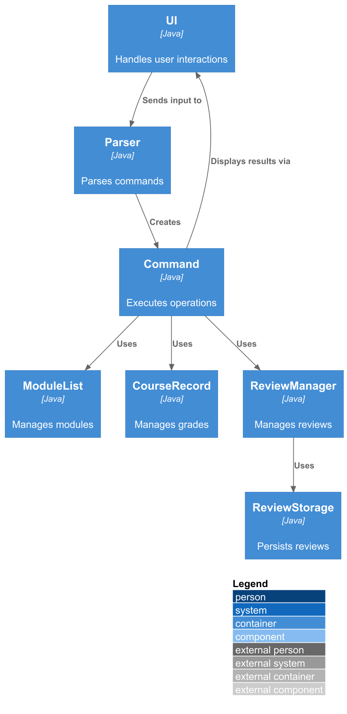

# Developer Guide

## Acknowledgements

* Java 17 - Programming language and runtime environment
* JUnit 5 - Testing framework for unit tests
* Markdown - Documentation format

## Design & implementation

### Architecture Overview

Uniflow is a command-line application designed to help students manage their university modules, timetables, grades, and course reviews. The application follows an object-oriented design with clear separation of concerns.



The architecture diagram above shows the high-level design of the application. The main components and their interactions are:

- **UI**: Handles all user interactions, reading commands and displaying results
- **Parser**: Parses user input strings and creates appropriate Command objects
- **Command**: Executes the requested operations on the data models
- **ModuleList**: Manages the collection of modules in the timetable
- **CourseRecord**: Manages completed courses for GPA calculation
- **ReviewManager**: Manages course reviews from students
- **ReviewStorage**: Handles persistence of review data to file

#### Main Components

**Uniflow (Main Class)**
- Entry point of the application
- Initializes core components: UI, ModuleList, CourseRecord, and ReviewManager
- Runs the main command loop that processes user input

**UI (User Interface)**
- Handles all interactions with the user
- Reads user commands via Scanner
- Displays messages, module lists, filtered results, and error messages
- Formats output with divider lines for clarity

**Parser**
- Parses user input strings into Command objects
- Supports multiple command types: insert, delete, list, filter, score, add grade, gpa, review, add review, show timetable, reset timetable, bye
- Validates command syntax and extracts parameters
- Throws UniflowException for invalid commands

**Command (Abstract Class)**
- Base class for all command types
- Defines execute() method that all commands must implement
- Provides isExit() method to determine if application should terminate

**Module**
- Represents a university module/course session
- Stores module ID, name, day, start time, end time, and session type
- Contains score breakdown as a Map for assessment components
- Provides methods to check for tutorials and retrieve module information

**ModuleList**
- Manages a collection of Module objects
- Provides methods to add, delete, retrieve, and filter modules
- Implements filtering by session type, day, ID, name, and tutorial presence
- Detects timetable clashes by checking time overlaps

**Course**
- Represents a completed course with code, credits, and grade
- Used for GPA calculation

**CourseRecord**
- Manages a collection of Course objects
- Tracks completed courses for academic record keeping

**ReviewManager**
- Manages course reviews from multiple users
- Stores reviews in a Map with course code as key
- Integrates with ReviewStorage for persistence

**ReviewStorage**
- Handles loading and saving of course reviews to file
- Uses pipe-delimited format: COURSE|USER|REVIEW_TEXT
- Creates data directory if it doesn't exist

### Command Execution Flow

```
User Input → Parser → Command Object → execute() → Updates Data → UI Output
```

1. User enters a command string
2. Parser analyzes the command and creates appropriate Command object
3. Command's execute() method is called with UI, ModuleList, and CourseRecord
4. Command performs its operation (add module, compute GPA, etc.)
5. UI displays the result or error message
6. Loop continues until user enters "bye"

### Key Design Patterns

**Command Pattern**: Each user action is encapsulated as a Command object (InsertCommand, DeleteCommand, FilterCommand, etc.), allowing for easy extension and modification.

**Singleton-like Access**: ReviewManager and CourseRecord are accessed through static methods in Uniflow class, ensuring consistent state across commands.

**Predicate-based Filtering**: ModuleList uses Java Predicate functional interface for flexible filtering operations.

### Design Details

#### Command Component


The Command component uses the **Command Pattern** to encapsulate each user action as an object. This design allows for:
- Easy addition of new commands without modifying existing code
- Consistent interface for all command types
- Clear separation of command parsing and execution logic

All command classes inherit from the abstract `Command` class and implement the `execute()` method. The placeholder `XYZCommand` represents additional command classes like `ScoreCommand`, `ShowTimetableCommand`, `ResetTimetableCommand`, `ReviewCommand`, `AddReviewCommand`, and `ExitCommand`.

#### Model Component


The Model component consists of:
- **Module**: Represents a course session with timing and session type information. Each module can store a score breakdown for different assessment components.
- **ModuleList**: Manages a collection of modules with operations for adding, deleting, filtering, and clash detection.
- **Course**: Represents a completed course with a grade, used for GPA calculation.
- **CourseRecord**: Manages the collection of completed courses.

The use of composition relationships allows ModuleList and CourseRecord to fully manage their respective collections.

#### Review Management Component


The ReviewManager handles in-memory storage of course reviews, while ReviewStorage manages persistence to the file system. This separation follows the **Single Responsibility Principle**, making it easier to modify storage mechanisms without affecting review management logic.

### Implementation Details

#### Insert Module Feature

The insert module feature allows users to add modules to their timetable with automatic clash detection.


How the insert feature works:

1. Parser creates an InsertCommand with a new Module object
2. InsertCommand checks for timetable clashes by calling `findClash()`
3. If a clash is detected, the user is warned and asked for confirmation
4. If no clash exists or the user confirms, the module is added to ModuleList
5. A success message is displayed showing the updated module count

The clash detection algorithm compares time ranges on the same day using Java's LocalTime class to determine if any overlap exists.

#### Filter Module Feature

The filter feature allows users to search modules using various criteria.


How filtering works:

1. Parser creates a FilterCommand with the filter type and value
2. FilterCommand calls the appropriate filter method on ModuleList
3. ModuleList uses predicate-based filtering to create a new filtered list
4. The filtered results are displayed to the user

The application supports filtering by: day, session type, module ID, module name, and tutorial presence. The predicate-based approach allows for flexible and extensible filtering logic.

#### GPA Calculation Feature

The GPA calculation feature computes the cumulative GPA based on completed courses.


How GPA calculation works:

1. ComputeGpaCommand retrieves all courses from CourseRecord
2. For each course, the letter grade is converted to a grade point (A+ = 5.0, F = 0.0)
3. The weighted sum is calculated: Σ(grade_point × credits)
4. GPA = total_grade_points / total_credits
5. The result is displayed with summary statistics

The grade point conversion follows the standard NUS grading scale.

#### Score Breakdown Feature

Modules can store assessment component scores for tracking purposes. The ScoreCommand parses input in the format `name:value` (e.g., "exam:50 participation:10") and validates that:
- Values are positive integers
- The format is correct (colon-separated pairs)

The breakdown is stored in the Module's scoreBreakdown Map for future reference.

#### Timetable Clash Detection

When adding a new module, the system checks for scheduling conflicts:

1. ModuleList iterates through all existing modules on the same day
2. For each module, it compares time ranges using `checkOverlap()`
3. Time strings are parsed into LocalTime objects for accurate comparison
4. Two time ranges overlap if: `!(end1 < start2) AND !(end2 < start1)`
5. If an overlap is found, that module is returned as the clashing module

This prevents students from accidentally scheduling multiple classes at the same time.

## Product scope

### Target user profile

Uniflow is designed for university students who:
* Need to manage multiple course modules and sessions (lectures, tutorials, labs)
* Want to track their academic performance and calculate GPA
* Prefer command-line interfaces for quick data entry
* Need to avoid timetable clashes when planning their schedule
* Want to access and share course reviews with peers
* Are comfortable with typing commands and structured input formats

### Value proposition

Uniflow solves several problems for university students:

**Timetable Management**: Students can quickly add modules with specific time slots and session types, with automatic clash detection to prevent scheduling conflicts.

**Academic Tracking**: The application allows students to record completed courses with grades and automatically calculates cumulative GPA, helping them monitor academic progress.

**Module Organization**: Students can filter and search modules by various criteria (day, session type, module code, name), making it easy to find specific classes or plan study schedules.

**Peer Reviews**: The review system enables students to share and read course experiences, helping with module selection decisions.

**Efficiency**: Command-line interface allows for faster data entry compared to GUI applications, ideal for students who need to quickly update their schedules between classes.

## User Stories

| Version | As a ... | I want to ...                       | So that I can ...                                        |
|---------|----------|-------------------------------------|----------------------------------------------------------|
| v1.0    | new user | see usage instructions              | refer to them when I forget how to use the application   |
| v1.0    | student  | add modules to my timetable         | keep track of all my classes                             |
| v1.0    | student  | delete modules from my timetable    | remove classes I've dropped                              |
| v1.0    | student  | list all my modules                 | see my complete schedule at a glance                     |
| v1.0    | student  | check for timetable clashes         | avoid scheduling conflicts                               |
| v2.0    | student  | filter modules by day               | see what classes I have on specific days                 |
| v2.0    | student  | filter modules by session type      | quickly find all my tutorials or labs                    |
| v2.0    | student  | search modules by code or name      | locate specific modules without scanning the entire list |
| v2.0    | student  | add my grades for completed courses | maintain an academic record                              |
| v2.0    | student  | calculate my GPA automatically      | track my academic performance                            |
| v2.0    | student  | store score breakdowns for modules  | track individual assessment components                   |
| v2.0    | student  | add reviews for courses             | share my experiences with other students                 |
| v2.0    | student  | read reviews for courses            | make informed decisions about module selection           |
| v2.0    | student  | reset my timetable                  | start fresh for a new semester                           |

## Non-Functional Requirements

1. **Usability**: Commands should be intuitive and follow consistent patterns. Error messages must be clear and guide users toward correct usage.

2. **Performance**: The application should respond to commands instantly (< 100ms) for typical operations with up to 50 modules.

3. **Reliability**: Data persistence for reviews should not fail silently. If file operations fail, users should be notified.

4. **Portability**: The application should run on any system with Java 11 or higher installed (Windows, macOS, Linux).

5. **Maintainability**: Code should follow object-oriented principles with clear separation of concerns. Each command class should be independent and easily modifiable.

6. **Data Integrity**: Grade point calculations must be accurate. Invalid grades should be rejected with appropriate error messages.

7. **Scalability**: The filtering mechanism should handle multiple filter criteria efficiently using predicate-based filtering.

## Glossary

* **Module** - A university course or subject with scheduled sessions
* **Session Type** - The type of class session (lecture, tutorial, lab, etc.)
* **Timetable Clash** - When two modules are scheduled at overlapping times on the same day
* **GPA** - Grade Point Average, calculated from course grades and credits
* **Score Breakdown** - Individual assessment components and their weightings for a module
* **Course Record** - Collection of completed courses with grades for GPA calculation
* **Review** - Student feedback and experiences shared about a specific course

## Instructions for manual testing

### Setting up the application

1. Ensure you have Java 11 or higher installed on your system
2. Download the Uniflow.jar file
3. Open a terminal/command prompt and navigate to the directory containing the jar file
4. Run the application: `java -jar Uniflow.jar`

### Testing Module Management

**Adding modules:**
```
insert i/CS2113 n/Software Engineering d/Monday f/14:00 t/16:00 s/lecture
insert i/CS2113 n/Software Engineering d/Tuesday f/10:00 t/11:00 s/tutorial
insert i/MA1521 n/Calculus d/Wednesday f/09:00 t/11:00 s/lecture
```
Expected: Each module is added with confirmation message showing module count.

**Testing clash detection:**
```
insert i/ST2334 n/Statistics d/Monday f/15:00 t/17:00 s/lecture
```
Expected: Warning about clash with CS2113 on Monday. Application prompts for confirmation.

**Listing modules:**
```
list
```
Expected: All added modules displayed with their details.

**Deleting modules:**
```
delete i/CS2113
```
Expected: First CS2113 entry removed. Confirmation message shows remaining module count.

### Testing Filtering

**Filter by day:**
```
filter day/Monday
```
Expected: Shows only modules scheduled on Monday.

**Filter by session type:**
```
filter type/tutorial
```
Expected: Shows only tutorial sessions.

**Filter modules with tutorials:**
```
filter hastutorial
```
Expected: Shows modules that have tutorial sessions.

**Filter by module code:**
```
filter id/CS
```
Expected: Shows all modules with "CS" in their code.

### Testing Grade Management

**Adding grades:**
```
addgrade c/CS2113 cr/4 g/A
addgrade c/MA1521 cr/4 g/B+
addgrade c/ST2334 cr/4 g/A-
```
Expected: Each course is added to academic record with confirmation.

**Computing GPA:**
```
gpa
```
Expected: Displays total courses, grade points, credits, and calculated GPA.

**Testing invalid grade:**
```
addgrade c/CS1010 cr/4 g/Z
```
Expected: Error message about invalid grade.

### Testing Score Breakdown

**Adding score breakdown:**
```
score CS2113 exam:50 project:30 participation:20
```
Expected: Confirmation that breakdown is saved for CS2113.

**Testing invalid breakdown format:**
```
score CS2113 exam:fifty
```
Expected: Error message about invalid format.

### Testing Review System

**Adding reviews:**
```
addreview c/CS2113 u/Alice r/Great course, very practical!
addreview c/CS2113 u/Bob r/Challenging but rewarding
```
Expected: Confirmation that reviews are added.

**Viewing reviews:**
```
review CS2113
```
Expected: Both reviews displayed with usernames.

**Viewing non-existent course:**
```
review CS9999
```
Expected: Message indicating no reviews found.

### Testing Timetable Commands

**Show timetable:**
```
show timetable
```
Expected: All modules displayed with index numbers.

**Reset timetable:**
```
reset timetable
```
Expected: Confirmation that timetable is cleared. Subsequent `list` should show empty timetable.

### Testing Error Handling

**Empty command:**
```
(press Enter without typing anything)
```
Expected: Error message about empty command.

**Invalid command:**
```
xyz
```
Expected: Error message about invalid command.

**Missing parameters:**
```
insert i/CS2113
```
Expected: Error about missing fields.

### Data Persistence Testing

1. Add several reviews using `addreview` commands
2. Exit the application with `bye`
3. Restart the application
4. Use `review` command to verify reviews are loaded
5. Check that `data/reviews.txt` file exists and contains review data in format: COURSE|USER|REVIEW

Note: Module and grade data are currently not persisted and will be lost on application restart.